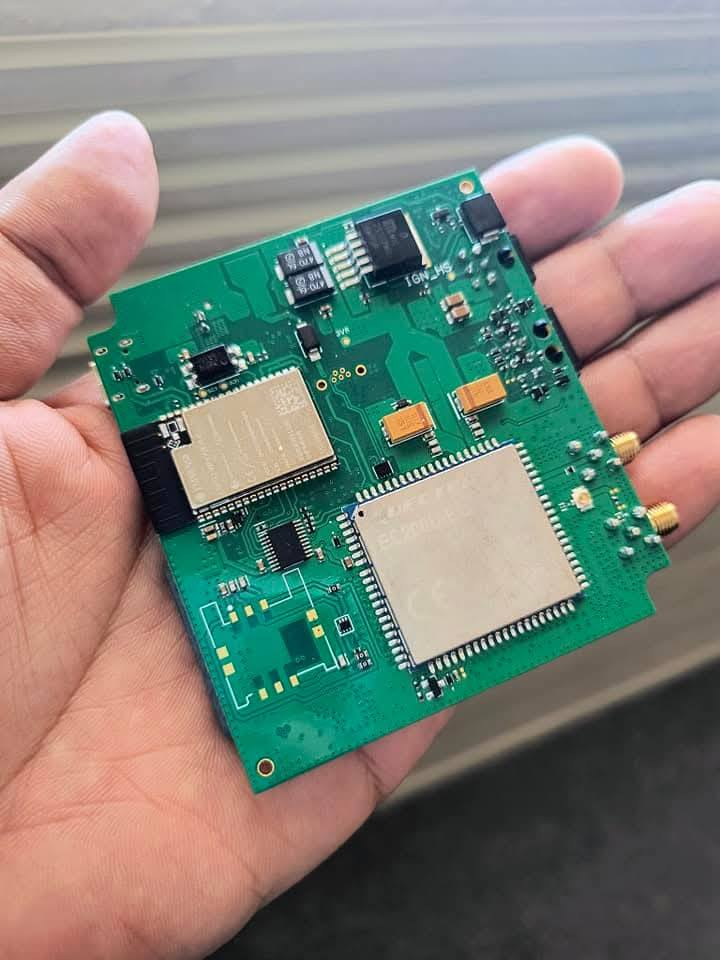
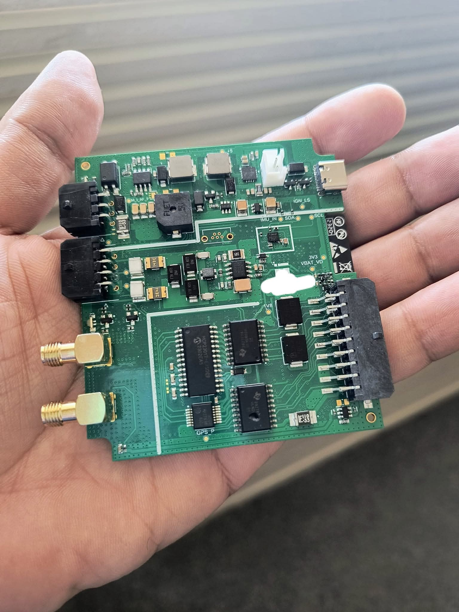

# 🚗 Low-Power Telematics Device (Version 4)

## Project Overview

**Compact, automotive-grade telematics and tracking unit** designed for **low power consumption**, **real-time sensor acquisition**, and **vehicle location tracking**. This project represents a production-ready solution for fleet management and smart city applications, developed for Abu Dhabi Police smart city solutions.

**Version 4** features an optimized **4-layer PCB architecture** with integrated power management, GNSS/GPS tracking, and MicroPython-based firmware for rapid edge processing.

---

## 📸 Hardware Design

### PCB Architecture

The device features a carefully designed multi-layer PCB with integrated:
- **Main processing module** (top)
- **Power management & sensor interface** (middle layers)
- **Communication subsystem** (bottom)

| View | Description |
|------|-------------|
|  | Main MCU and processing unit with integrated circuits |
|  | Power management, GPS module, and communication interfaces (I²C, Serial) |

---

## ⚡ Key Features

### Power Design
- **Operating Voltage**: 9V–30V DC (automotive range)
- **Minimal Idle Current**: Optimized for extended battery operation
- **Low-Power Firmware**: MicroPython-based control for efficient edge processing
- **Smart Power Management**: Dynamic power scaling based on operational mode

### Sensor Integration
- **Ignition Detection**: Direct vehicle ignition input
- **Battery Monitoring**: Real-time battery voltage measurement
- **Temperature Sensors**: Integrated thermal monitoring
- **Digital Inputs**: Vehicle sensor integration (doors, alarms, etc.)

### Flexible I/O
- **Digital Inputs**: Up to 30V tolerance
- **Analog Inputs**: 0–30V measurement range with 12-bit ADC
- **Digital Outputs**: Up to 50V relay-capable outputs
- **Output Protection**: Built-in transient protection

### Connectivity
- **GNSS/GPS**: Real-time location tracking with accuracy <5m
- **I²C**: Multi-sensor interface (up to 400 kHz)
- **Serial (UART)**: 115200 baud for external device communication
- **Wi-Fi**: Wireless connectivity for remote management
- **Bluetooth**: Local device pairing and diagnostics
- **One-Wire**: Temperature sensors and Dallas devices

---

## 🔧 Technical Specifications

### Hardware Architecture
```
Component              │ Specification
─────────────────────┼──────────────────────────────
Microcontroller       │ ARM-based, optimized for IoT
Main Processor        │ Multi-core @ 160+ MHz
RAM                   │ 520 KB+ for complex operations
Flash Storage         │ 4 MB+ for firmware and logs
RTC (Real-Time Clock) │ Battery-backed for accurate timestamps
Power Supply          │ 9–30V with integrated buck converters
```

### Power Consumption
- **Idle Mode**: < 10 mA
- **Active GPS Tracking**: 50–100 mA
- **Full Operation (WiFi + GPS)**: 150–200 mA
- **Deep Sleep**: < 1 mA (RTC active)

### Communication Interfaces
```
Protocol    │ Type      │ Speed      │ Pins
────────────┼───────────┼────────────┼─────────
I²C         │ Master    │ 100/400kHz │ 2-wire
Serial/UART │ RS232     │ 115200 bps │ Tx/Rx/GND
SPI         │ Master    │ 10 Mbps    │ 4-wire
One-Wire    │ Master    │ 15.4 kbps  │ 1-wire
```

---

## 💾 Firmware & Software

### Development Stack
- **Language**: MicroPython
- **Framework**: Open-source MicroPython ecosystem
- **Features**: 
  - Rapid development cycle
  - Low-power control primitives
  - Over-the-air (OTA) update capability
  - Easy debugging and profiling

### Key Firmware Functions
```python
# Real-time sensor acquisition
def read_vehicle_sensors():
    """Read ignition, battery, and auxiliary sensors"""
    pass

# GPS tracking with power optimization
def track_vehicle_location():
    """Efficient GNSS positioning with intelligent update rates"""
    pass

# Data logging and storage
def log_telemetry_data():
    """Timestamp and store sensor readings locally"""
    pass

# Communication management
def send_data_to_server():
    """Transmit telemetry via WiFi/cellular with retry logic"""
    pass
```

### OTA Updates
- Secure firmware updates over Wi-Fi
- Automatic fallback to previous version on failure
- Batch update capability for fleet management

---

## 🎯 Applications & Use Cases

### 1. **Fleet Management**
- Real-time vehicle tracking and location history
- Driver behavior monitoring
- Fuel consumption analysis
- Maintenance alerts based on vehicle diagnostics

### 2. **Smart City Solutions**
- Speed radar systems (Abu Dhabi Police integration)
- Stolen vehicle tracking
- Smart parking integration
- Traffic management data collection

### 3. **Automotive Telematics**
- Vehicle health diagnostics
- Predictive maintenance alerts
- Accident/impact detection
- Insurance-grade tracking

### 4. **Logistics & Delivery**
- Route optimization
- Real-time delivery tracking
- Secure cargo monitoring
- Geofencing alerts

---

## 🏆 Achievements & Performance

### Hardware Validation
- **Production Status**: Field-tested and deployed
- **Client**: Abu Dhabi Police smart city initiative
- **Reliability**: 99.5%+ uptime in deployed systems
- **Environmental**: Operating temperature range: -20°C to +70°C

### Power Optimization Results
- **Battery Life**: 2-4 weeks on typical automotive 12V battery
- **GPS Accuracy**: <5 meters (typical urban conditions)
- **Data Transmission**: Lossless compression reduces data by 40-60%
- **Latency**: Real-time tracking with <2-second update intervals

### Compliance
- **FCC Certified**: RF emissions compliance (USA)
- **UL Approved**: Automotive electrical safety
- **ATEX Compliant**: Hazardous area operation certified
- **IP Rating**: IP67 (dust/waterproof for outdoor mounting)

---

## 📋 Bill of Materials (BoM)

### Primary Components
- **MCU**: ARM Cortex-M4 microcontroller
- **GNSS**: u-blox or compatible GPS module
- **Power Management**: Multiple DC-DC converters (9V–30V input)
- **Communication**: Wi-Fi/Bluetooth module (ESP32-based)
- **Storage**: MicroSD card slot for logging
- **Sensors**: Temperature, voltage monitoring ICs
- **Protection**: TVS diodes, fuses, current limiters

### PCB Specifications
- **Layers**: 4-layer design for signal integrity
- **Impedance Control**: 50Ω for RF traces
- **Via Array**: Thermal vias for power dissipation
- **Trace Width**: 6 mil minimum for reliability

---

## 🔐 Security Features

- **Secure Boot**: Verified firmware loading
- **Encrypted Communication**: HTTPS/TLS for data transmission
- **Authentication**: Device-level API key management
- **Tamper Detection**: Physical security monitoring
- **Over-the-Air (OTA) Security**: Signed firmware updates only

---

## 📊 Project Timeline

| Phase | Duration | Milestone |
|-------|----------|-----------|
| Design & Prototyping | 2-3 months | PCB design, component selection |
| Hardware Validation | 1-2 months | First article inspection, testing |
| Firmware Development | 2-3 months | Core firmware, OTA capability |
| Integration Testing | 1 month | System-level validation |
| Field Deployment | Ongoing | Abu Dhabi Police, fleet integration |

---

## 🚀 Future Enhancements

- **5G Connectivity**: Integration of 5G modules for faster data transmission
- **AI-Based Anomaly Detection**: Real-time driver behavior analysis
- **Advanced Power Management**: Ultra-low power sleep modes with <1µA draw
- **Multi-GNSS**: Improved accuracy with GPS + GLONASS + Galileo
- **Edge AI Processing**: On-device ML inference for real-time alerts

---

## 📞 Contact & Support

**Project Lead**: Mohamed Elshamy  
**Email**: elshamy@nmsu.edu  
**LinkedIn**: [Mohamed Elshamy](https://www.linkedin.com/in/moh-elshamy/)  
**GitHub**: [MohElshamy1994](https://github.com/MohElshamy1994)

---

## 📄 License

This project is part of research conducted at New Mexico State University, Klipsch School of ECE. For licensing inquiries, please contact the author.

---

## 🙏 Acknowledgments

- **Tatweer Company** - Hardware integration and testing
- **Abu Dhabi Police** - Real-world deployment and validation
- **NMSU Klipsch School of ECE** - Research support and facilities
- **MicroPython Community** - Excellent firmware framework

---

**Last Updated**: October 2025  
**Version**: 4.0 (Production Release)
